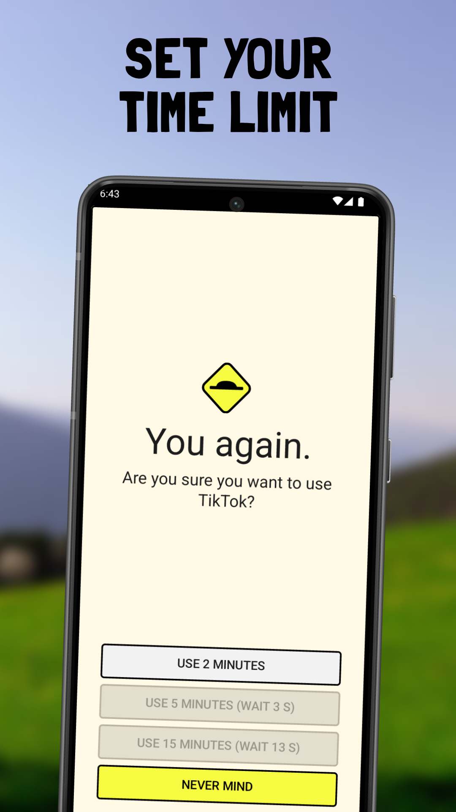
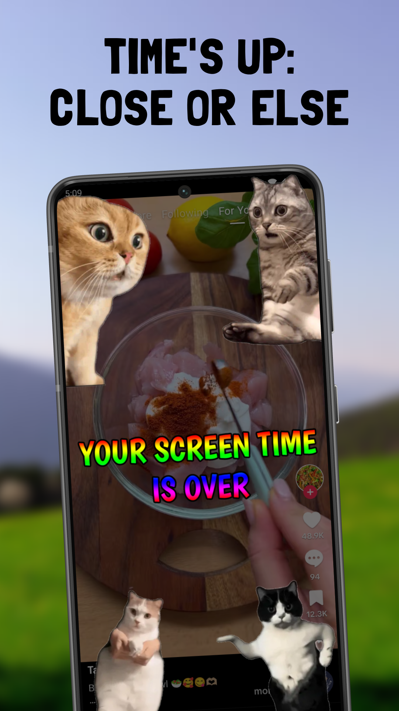

For 3 months, I've been building [SpeedBump](/), an app to get you off the phone.

Doomscrolling is a problem so captivating that I actually [quit my job to solve it](https://nullderef.com/blog/quit-job-2024/). And I'm glad I did, because the work behind this funny app is *endless*. However, this also means that at some point I need to make a living with it -- even if I'm not in a hurry.

My app seems to make for a great product. People share encouraging feedback, telling me how it helps them have a healthier relationship with their phone. This review was written by someone who *isn't my friend*:

Isn't that *super* cool???

The question is: does SpeedBump make for a good business? Truth is, I didn't have that question too much in my mind when I started.

Pricing is a necessity that users would rather avoid; ideally, everything is free. That's because every monetization option has downsides which -- as a long-time phone user -- I've felt:

* Subscription burnout
* Intrusive advertisements
* Selling data
* ...the list goes on

Can we find a middle point between monetizing a product and being an ass?

## What the other guys are doing

Not that *I* need to do the same, but it gives me a baseline for comparison[^rounding][^location][^discounts][^fake-free][^revenue].

Feel free to skip if it's too much info. You can come back to this section later on:


  

    
    <h3>{{ app.title }}</h3>
    

      
      
{{ line | markdownify }}

      
    

  



## Relying on donations

Did you know SpeedBump isn't the only meme-y app I've built?

Back in 2018, I released "Meme Stickers for WhatsApp" to the Play Store.

  

    
    
  

WhatsApp had just added support for stickers in the chat. With apps like mine, you could download pre-built packs of stickers.

It was among the first of its kind and focused on a popular niche, memes. So its growth was *spectacular*. In exactly 13 days, it already had 1 million downloads! For comparison, SpeedBump has 0.0003 million downloads after 60 days -- and that's after [some marketing](/en/blog/mobile-app-promotion/).

  

    
    
  

As a monetization strategy, I had set up a Patreon to get donations.

...but in its entire lifetime, I didn't receive a single donation. 0. Nada.

Don't get me wrong -- this isn't a fair comparison with SpeedBump. The stickers app didn't provide so much value: you only had to open it once, add your stickers to WhatsApp, and then forget about it completely. It's also a nuanced story that I'll elaborate on in another post.

But having worked in more projects that rely on donations (mainly open source ones), I'm well aware of the struggles. And I'd rather avoid that path.

### The happy ending for the sticker frenzy

I was extremely lucky to see this somewhat sketchy email in my inbox:

![Good Mornign \[sic\] Glow Apps Team, Would you like to sell your new Meme Stickers for WhatsApp App? (link to app) Best regards](stickers-email.jpg)

It was my first year of university and I felt more lost than an octopus in a garage (that's a Spanish expression for you). So I proposed working together instead -- maybe I'd learn from him.

Long story short, he saved my ass by revamping the app and putting ads in it. We probably went too far, going from a 4.4-star rating to 3.7 after reaching 5 million downloads. So I'm not incredibly proud of it.

But who cares? It was a stickers app soon to be irrelevant. With SpeedBump, I'm in it for the long run.

### The exception: ScreenZen

ScreenZen is known for being tip-only. It started as a side project, so the creator presumably didn't need too much money.

[We only have revenue *estimations*](#what-the-other-guys-are-doing), but both Android and iOS apps indicate &lt;$5k per month. It could be anywhere from $0 to $10K -- it's too low for the platform to give an exact number.

ScreenZen notes that the pricing may change, but that might give him a hard time with the community.

TODO: screenshot of the note in the app.

## Subscriptions: the Bad Guys

Everyone's tired of subscriptions -- they're everywhere. But that's for a reason: they kinda work.

Note that I'm not considering putting SpeedBump behind a pay wall. The current features will always be free. My goal is to help as many people as possible, including those who aren't necessarily severly addicted.

### Maybe you should provide enough value

Opal is both the biggest and *most expensive* screen time app. Yet it boasts a 4.8 rating. They've probably made healthy phone usage more accessible than anyone else.

Not many people would pay for a screen time app. But that's the point of a freemium model.

Only TODO% of Spotify users pay. And that's after the company spent *millions* on optimizing it. But it's still enough for them to keep going.

### Hibernating subscriptions

Automatic renewals give subscriptions a scammy look: you sign up for a free trial, forget about it, and get charged. You can resolve some cases through customer support, but it's a dark pattern.

What companies like Kagi do is [hibernating subscriptions](https://untested.sonnet.io/notes/auto-hibernate-subscriptions/). If you aren't using their services anymore, they will automatically put it on pause for you. TODO: put more details here (how long? is it a pause?)

TODO: is this possible with the Play Store? Can I cancel a subscription automatically after the app is disabled for long enough?

### Community subscriptions

Finch is a habit tracker that feels like a game. They've built an awesome community that they leverage for pricing. TODO: explain how it works.

### Lifetime payment

Let's take a look at One Sec. Its monthly subscription is among the cheapest at 1-2€

![1 star out of 5 review: I am over it 👎. I have loved this app since I began using it 6 months ago. It even inspired me to purchase my cousin an iPhone, knowing that I would be able to restrict their screen time and break the dopamine-induced doom scrolling that social media and games can oftentimes induce. When I was going to sign up for the family plan, I saw the price had increased from $25 to $40. For reference, the individual plan is $20. Honestly, if I only intended to add one additional user to the subscription, what incentive is there in not receiving a discount? Look at it this way: 2x individual plans = $40; 2x users on family plan = $40. What's the difference? This is really shortsighted and selfish of the developer, in my opinion, and it makes me want to not even renew the individual subscription. $40 is too much. The app is good and well thought out, but it isn't actually providing that grand of a solution to justify that price, even for multiple users. $25 actually motivated me to add users to the app, given it was only a $5 increase from what I was paying. Doubling the price only frustrates me and makes me want to protest the developer's greed, and it shows that their intent isn't to actually provide a solution and make that accessible to more people, but to squeeze every dollar from their user base. What a careless decision towards users. I'll be deleting the app.
](one-sec-review.png)

## Pay Once

When the Play Store came out, paying once was the golden standard. Many As the popularity of phones grew, most apps changed to subscriptions. TODO: maybe look up some statistics

Business-wise, it makes sense. Server costs are ongoing, so recurring payments make sure the costs are always covered.

## Ads

Advertisements only work if your users spend time in the app. Which is like, the complete opposite of what I'm trying to do.

I've [asked users](/en/blog/v1/), and they rarely open the app -- awesome. And when they do, it's for something quick like updating the list of restricted apps.

This leaves us with only two spots where ads make sense:

  

    

      
      
The screen shown when you open restricted apps after having taken a break. It helps you be intentional and set a time limit.

    

    

      
      
The annoyances that appear when your chosen time is up. They're customizable: dancing cats, the screen time police, or rain in your phone.

    

  

In one of my feedback forms, someone legit called me an idiot for not putting ads on the second one (TODO: what was the actual word??). That's what AppBlock does (TODO: fact-check as maybe it's both or only the first, also look for other examples, and take screenshot).

Still, AppBlock probably makes most of its income from subscriptions. Just like Spotify, the ads on the free version are more of an incentive to get premium users than an income stream.

TODO: picture of where Spotify gets the money from (comparing subscriptions vs. ads).

### Well-Integrated Ads

Two other issues with advertisement are:

- **Privacy concerns**: personalized ads need to get the data from somewhere:
  - "Why should this screen time app know that I'm into cycling?"
  - "How can I be sure this screen time app is not sharing my usage with other apps?"
- **Intrusiveness**: ads get in the way of the user, worsening their experience. They clutter the interface, moreso if they aren't personalized.
  - "This ad banner is so annoying, and it's telling me to buy shampoo while I'm bald!"

So my favorite way to approach ads is partnerships. Imagine if Duolingo and SpeedBump collaborated in showing you the green owl when your time is up in a restricted app. Or if Nike told you to go for a run.

Sure, it's still an ad. But it respects your privacy, and can be integrated in a way that makes sense for SpeedBump. Similar to how there are cats dancing on your screen, it could be the green owl doing breakdance.

TODO: picture or GIF of Duolingo owl doing something funny

Unfortunately, these huge partnerships are only possible when SpeedBump has more users. And I'm not quite sure how much money they'd actually bring to the table. But it'd be super cool from my point of view (feel free to disagree!).

## Money for growth, not just making a living

My objective since the beginning has been to make quitting doomscrolling something accessible. Anyone should be able to do it.

Something I've learned is that the objective isn't just to sustain myself. Growing SpeedBump is what makes it accessible -- but that costs money.

If a tree falls in a forest and no one is around to hear it, does it make a sound? If my app is amazing but no one knows about it, does it make a difference?

This is particularly important in this space. People are increasingly aware of the problems caused by excessive social media usage. But not to a point where the majority does something about it.

At the same time, I need money. Not just for myself, but also to grow the business. Promoting your app costs money, but making your app more known is precisely how you make it accessible. Building something and waiting for everyone isn't perfect -- it takes a very long time and hits limits.

## Wrapping up

Here are the monetization options for SpeedBump:

- One time payment for Pro features
- Hibernating subscriptions for Pro features
- Advertisements through partnerships

[^rounding]: Numbers are rounded for simplicity.
[^location]: Prices may vary according to the country. This analysis was based in Germany.
[^discounts]: No special discounts applied -- just the regular price on the app or website. For example, One Sec has a 50% discount for students, and other offers for families.
[^fake-free]: Technically, some apps have a free version. But it's so limited that I consider it paid. For example, if blocking more than one app requires a subscription, it's not really free. This includes: One Sec, Clearspace, BePresent.
[^revenue]: Monthly revenue estimations taken from https://appfigures.com/market/explorer
