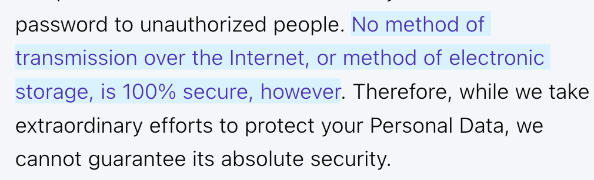
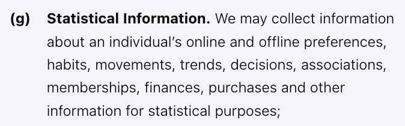
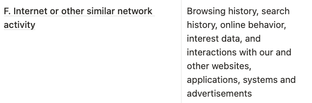

I'm building SpeedBump, an [intentionally annoying app to break doomscrolling](/en/). Such apps need access to the apps you open and use at all times, so I've been wary about privacy. Thus, SpeedBump doesn't collect **any** data other than crash reports.

## Prototypes don't need to collect data

Collecting data (_quantitative_) is actually discouraged for prototypes. New products should focus on asking people through surveys, calls, and conversations (_qualitative_).

For example, I'd rather hear from a user that the app is too annoying than to figure it out by looking at data. Why?

1. Prototypes don't have many users. Analyzing data based on a user base of 30 is not a good idea.
2. People's stories are anecdotal, but they give you more information. When I talk with people, they share their opinion on phone addiction in general, what methods they tried, what worked and what didn't, and much more.

Thanks to qualitative data, [I discovered that my app sucked](/en/blog/v1/) at first. No code needed, just a survey and some chats.

## Collecting data actually helps improve the app

However, as your user count grows, anonymized data can be genuinely helpful.

With just qualitative data, you're limited to being reactive rather than proactive. You can detect bugs instead of waiting for someone to complain. And users rarely complain because they have other things to do -- they'll just uninstall.

This data also enables you to optimize the app. How should I know if people use their phones less when I force them to take a 10-minute break versus a 15-minute one? You try both versions on randomized groups of users and look at their average screen time -- an A/B test.

## What kind of data collection is intrusive?

So far, I talked about anonymized data.

## Do users care?

In reality, the majority don't care enough -- they just want to use the app.

Privacy-wary users are a loud minority. It depends on the industry, but TODO study.

## Privacy policies of other screen time apps

* TODO: reach out to those with red flags to ask them.
  * clearspace about F. section with personal data
  * clearspace about "Mobile Device Access" -- does camera/microphone info get stored somewhere
* TODO: remove this: The apps could clarify ambiguous statements as a response to this post -- I don't mean to shame anyone.

As research, I read the privacy policy of the 6 most popular screen time apps. I promise I didn't just feed it to an LLM; this was a pain.

No apps state that they sell your data, but it could still end up in the hands of others:

* Through **business transfers**: if [Meta buys Opal](/en/blog/opal-bought-by-meta/), then Meta owns its data.
* Within **associates**: Clearspace has a broad definition for whom they may share data with:

  

* Due to a **security compromise**: no system is 100% secure, which Opal, BePresent and Clearspace mention (good!):

  

* To comply with the **law**: every company must disclose information with authorities in case of investigations.

### Red flags

It's hard to say "app X is bad" given how complex and ambiguous privacy policies are. Instead, I can point out red flags 🚩.

[Annex&nbsp;I](#app-usage) lists what data each app collects. It's an easy read, but before jumping to conclusions we should clarify a few things.

### Usage data

In theory, screen time apps on iOS don't have access to data about the apps you use. When you start blocking an app, Apple gives developers an encrypted token, which they can use to set up limits. But at no point do they know *what* app you're blocking.

TODO: image

Clearspace works around this limitation by simply asking the user what app they just blocked. I'm not sure why they do this or if it's allowed, though.

### Tracking across apps

TODO: the popup content may differ per app? Take screenshots of the others, too

#### Opal

#### Clearspace

They have a feature to compete against friends

![Other Users. When you share personal information (for example, by posting comments, contributions or other content to the App) or otherwise interact with public areas of the App, such personal information may be viewed by all users and may be publicly made available outside the App in perpetuity. If you interact with other users of our App and register for our App through a social network (such as Facebook), your contacts on the social network will see your name, profile photo, and descriptions of your activity. Similarly, other users will be able to view descriptions of your activity, communicate with you within our App, and view your profile.](clearspace-other-users.png)

#### BePresent

### Tracking across devices

---

## Annex I: Data collected by apps

| **App**    | 👤 | 💵 | 🔧 | 🧪 | 📱 | *️⃣ |
|------------|---|---|---|---|---|---|
| [Opal](https://www.opal.so/terms)                                                               | ✅ | ✅ | ✅ | ✅ | ✅ | ✅ |
| [ScreenZen](https://www.screenzen.co/privacy)                                                   | ✅ | ✅ | ✅ | ✅ | ❌ | ✅ |
| [One Sec](https://one-sec.app/privacy/)                                                         | ✅ | ✅ | ✅ | ✅ | ❌ | ✅ |
| [Clearspace](https://getclearspace.notion.site/Privacy-Policy-1d2959a3b6a14791aff5874704623820) | ✅ | ✅ | ✅ | ✅ | ✅ | ✅ |
| [AppBlock](https://appblock.app/privacy-policy-google-play/)                                    | ✅ | ✅ | ✅ | ✅ | ❌ | ✅ |
| [BePresent](https://www.bepresentapp.com/privacy-policy)                                        | ✅ | ✅ | ✅ | ✅ | ✅ | ❌ |

### Legend for the kinds of data collected

* 👤 **Personal**: may include contact information, email, phone number
  * *Only collected after logging in*
* 💵 **Payment**: may include personal data, location, date of birth
  * *Only collected after paying, often by a third-party service*
* 🧪 **Behavioral**: may include screens visited, actions performed
  * *Refers to behaviors in the app blocker itself (like Opal)*
  * *Usually anonymized*
* 🔧 **Technical**: may include device information, logs, crash reports, IP address
  * *Sometimes anonymized (crash reports may ask for contact info so that they get back to you)*
* <mark>📱 **Usage**: may include what apps you use, how often, and usage patterns</mark>
  * *TODO: anonymized??*
* <mark>*️⃣  Other</mark>
  * **Opal**: social media usernames (if user chooses to connect their accounts)
  * **ScreenZen**: screen recordings (when the user reports a bug)
  * **One Sec**: sleeping activity
  * **Clearspace**: user-to-user communication through the app, camera and microphone (presumably the "pushups to earn screen time" feature)
  * **AppBlock**: app configuration (if backups are enabled)

## Annex II: Privacy consent in apps

| **App**    | Assumed | Opt out | iOS pop-up | *️⃣ |
|------------|:-------:|:-------:|:----------:|---|
| Opal       |    ✅    |    ❌    |      ✅     | ❌ |
| ScreenZen  |    ✅    |    ❌    |      ❌     | ❌ |
| One Sec    |    ✅    |    ❌    |      ❌     | ❌ |
| Clearspace |    ✅    |    ❌    |      ✅     | ❌ |
| AppBlock   |    ✅    |    ❌    |      ✅     | ✅ |
| BePresent  |    ✅    |    ❌    |      ❌     | ❌ |

### Legend for the kinds of consent

* **Assumed**: onboarding doesn't include a step to explicitly accept the privacy policy.
* **Opt out**: the app has a section in settings to opt out of anonymized data collection (🔧&nbsp;and&nbsp;🧪 in [Annex&nbsp;I](#app-usage)).
* **iOS pop-up**: the app shows the iOS popup "Allow App to track your activity across other companies' apps and websites?".
* *️⃣  Other:
  * **AppBlock**: has a link to the privacy policy during onboarding
