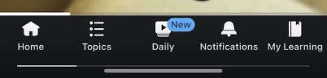

[I'm building SpeedBump]({{ '/blog/v1' | locale_url }}), an intentionally annoying app to get you off the phone. But after three months of work, it's hard to find a definitive answer to "should I continue working on this?". I ended up giving marketing a try; follow me in my path of fails as a first-time founder with little budget.

Opportunity cost is a problem -- maybe another project would be more worthy of my time. So I started spreading the word about SpeedBump: if people like it enough, that's a good signal!

But I quickly realized you can't just "quickly dip your toes in marketing". It's time consuming -- especially working alone -- and a new skill for me.

## Define a market, you dummy!

My first mistake was not clearly defining a market. By default, I assumed my target audience was in the US because it's the fast track:

- 300M people speaking the same language and sharing a similar culture.
- iPhone is a majority, and its users tend to spend more money on apps than Android.
- Building a prototype on Android is a pain.

*Source: [StatCounter](https://gs.statcounter.com/os-market-share/mobile/united-states-of-america)*

In reality, targeting the United States brought me headaches:

* The first version of SpeedBump is for Android because it's what I already knew. Mysteriously, [the iOS waitlist](https://forms.gle/HoBqN2URBBnBpva46) was increasing, but not the count of app downloads.
* It took me a while to realize, but living in Germany my TikToks aren't shown to the US. Europeans understand English but prefer their native language for day-to-day content.

So I pivoted to targeting Germany, where I live, and Spain, where I'm from. These countries have an Android market share of 61% and 76%, respectively. This gives me a higher chance of users actually downloading the app.

## Launching my app

An easy way to get some eyes on your product is to launch on sites like [Product Hunt](https://www.producthunt.com/). Each day, this platform lists new products, and people get to vote on which ones they like most.

It felt crazy to compete against teams developing super cool things like AR glasses. All while the banner I used for the launch seemed done by a kid on MS Paint from 2003. For real, look at it:

Impressively, SpeedBump got 7th place of a random Tuesday in March! The site didn't get *that* much traffic, so I stressed out unnecessarily. It's a US-mostly platform, which I'm not directly targeting, but it served as a signal that people do like the project.

Their Twitter account also highlighted SpeedBump, with a quote I liked:

I also tried [IndieHackers](https://www.indiehackers.com/) to no avail -- does anyone actually use that site?

## Search Engine Optimization (SEO)

SEO is the art of making your website appear first in Google. It's well established, so it was easy to do the basics. Plus, identifying what terms people use to find your problem is useful beyond SEO.

Not wanting to raise investor money, I'm also stingy. And holy crap is SEO expensive!

Free tools including Google Keyword Planner only go so far, unfortunately. Ahrefs' Starter plan at $29/month ran out of credits after a single afternoon. But Semrush has a powerful free trial, so that worked out better.

Importantly, people use more than one search engine. The concepts are similar, but the tools vary and their search terms differ:

* **On the Play Store or App Store**. People don't go there to learn, they try to find a specific app. Appfigures offers a 14-day trial which helped me set up the basics.
* **On social media**. Queries are more similar to Google, but tend to follow trends. The [Creator Search Insights](https://newsroom.tiktok.com/en-us/creator-search-insights) provided by TikTok is amazing (and free!). You can use it to learn demographics, which is something other SEO platforms don't provide.

[My personal blog](https://nullderef.com/) taught me the importance of SEO. Sure, launching an article (or product) will get you a spike of views. But what keeps the blog alive is the keyword "rust plugin system", which people keep searching for. SEO is rather long-term and "do once and forget".

The best resources I found were [Ilias Ism's YouTube channel](https://www.youtube.com/@illyism) and [Backlinko](https://backlinko.com/). Ilias has videos where he roasts websites, so I'd go like "crap, I'm also messing that up". Backlinko has high-quality articles that go into detail about SEO.

## Viral app marketing

This was a huge rabbit hole! Ironically, I've never used social media more than when building an app to reduce social media usage. There's a lot of irony in this project.

My strategy is heavily influenced by the fact that SpeedBump has no followers anywhere. I'd upload a Reel to Instagram and literally get 0 views. My personal account helped a bit, along with my LinkedIn followers. But they aren't necessarily the perfect user for SpeedBump.

So I ended up using TikTok a lot, where you don't need followers at all. A new account can easily get a viral video. It's incredibly common to promote your products on TikTok -- on the opposite end of Reddit, where I struggled to share anything, even if it was in the interest of the community.

YouTube Shorts is similar; it's just longer-term. Which is what I love about YouTube. Today, my feed suggested me a 17-year old video titled "Worlds fastest smoker". Pure gold, honestly. This is what I come to the Internet for.

Posting to over 6 platforms initially was a huge mess without a specialized tool. For now, I've simplified my life and dropped Facebook, Reddit, Twitter, and Instagram. I just post on TikTok, and repost it on YouTube Shorts. When I get more traction (and money), I can consider other platforms.

By the way, it's insane that even LinkedIn has now a TikTok-like feed. Like feverish-dream kind of insane.

My favorite resource to learn how to do TikToks has been ["Money Mind Unfiltered"](https://www.youtube.com/@moneymindunfiltered). Very transparent guy with deep dives on how he does short-form videos himself. The case studies in [Social Growth Engineers](https://www.socialgrowthengineers.com/) help see how this is done in real life.

Side question: does anyone use hashtags anymore?

## What's next

One last high-quality resource I can share is [Growth Unhinged](https://www.growthunhinged.com/), which covers broader topics.

No regrets about learning marketing. I've learned a ton, and these are just the basics. But it hasn't helped me decide on the future of SpeedBump.

I've realized that asking "should I continue working on this?" was wrong. Instead, it should be: "does this make for a good enough business?".

Even if that wasn't the case, I'd keep SpeedBump as a side project just because it's so fun and useful. But my goal after all is to make a living. Coming next: how to do that. Might take another while.
