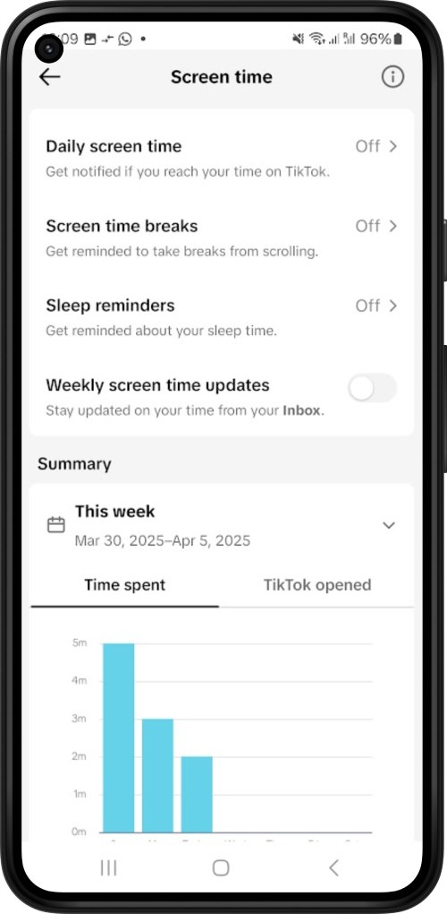
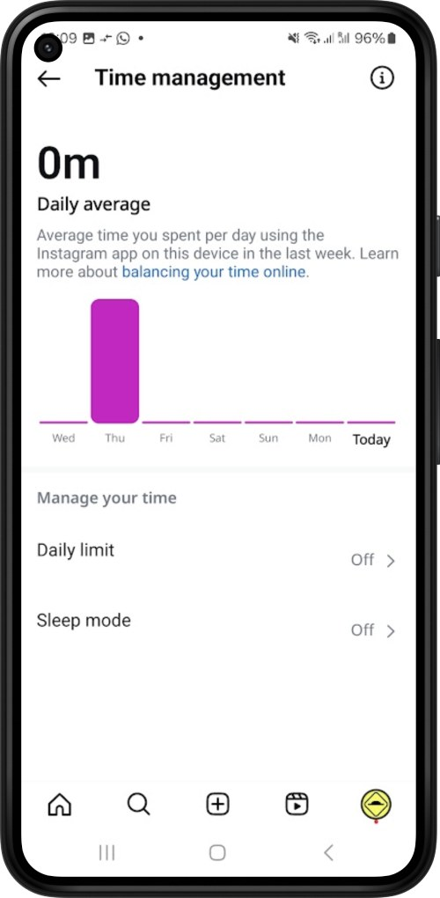

Opal is possibly the most popular screen time app on the App Store, with over 40k ratings. In an unexpected turn of events, the company [announced on X](https://x.com/withopal/status/1907029291239383401) that it's now owned by Meta:

The video showcases an iPhone with built-in features for Meta products like WhatsApp and Instagram. Only Android makes such integrations possible, with some apps blocking specifically Reels within Instagram or YouTube Shorts.

In the video, founder Kenneth Schlenker confirms that they do not intend to sell any data, spread misinformation, or compromise their values.

Only some moments later did some followers realize it was part of their April's Fools prank:

We've already seen companies like Instagram or TikTok adding screen time limits to their apps. You can find them hidden in the settings page, and they aren't too effective. But surely this is a concern that a large company like Meta might have?

  

    
    
  

Screen time apps are no stranger to Venture Capital, with [Opal having raised $4.3 million in 2021](https://techcrunch.com/2021/01/26/opal-raises-4-3-million-for-its-digital-wellbeing-assistant-for-iphone/). The Clearspace app also [went through the YC Combinator startup program](https://www.ycombinator.com/companies/clearspace), granting them $500k.

With the growing popularity of such apps, what's yet to be known is how big tech will react. As the saying goes, "if you can't beat them, join them"?
