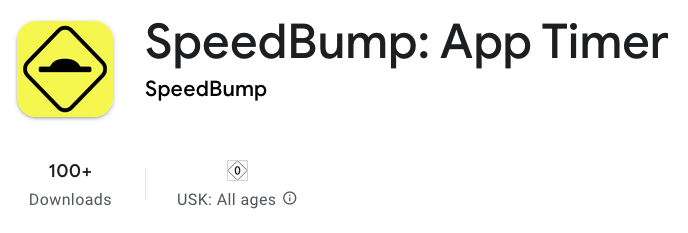
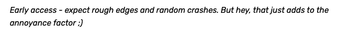

Good news: SpeedBump is no longer qualified as "Early Access" on the Play Store! [Your review would be invaluable](https://play.google.com/store/apps/details?id=com.capyapps.speedbump&utm_source=speedbumpapp.com&hl=en).

The app is by no means perfect, but [the idea itself doesn't suck anymore](/en/blog/v1/), and major bugs are under control. Reviews now count toward the Play Store ranking, affecting its visibility in "Top Charts" and search results.

Time to say goodbye to this snarky remark:

One feature I wanted to add before this milestone was streaks. They count the number of days you've gone without turning off SpeedBump or disabling one of the apps. Not that it was absolutely essential, but such actions needed more friction, even if psychological.

You can also customize what screens will appear when your configured time runs out. That includes the screen time police, rain, cats, or the pop-ups -- pick your favorites.

Having a couple of new features and a theme in the interface makes the app seem more polished. It now looks less like a virus you'd get from a site you shouldn't have clicked on. That's good, I think.

I'm still trying to get the hang of [mobile app promotion](https://speedbumpapp.com/en/blog/mobile-app-promotion/). An analogy as to how it feels is a wall.

The easiest part is done, which is developing an initial version of the app. Don't get me wrong -- it took plenty of effort. But coding is a challenge I know very well. Creating TikToks? Now, *that's* out of my comfort zone. Or worse: sending cold emails to ask for reviews. That sucks.

Maybe the moral of the story is to embrace the wall. Just like embracing boredom when some dancing cats are preventing me from opening Instagram to procrastinate.

If I stare for long enough at the wall, it might eventually collapse?

